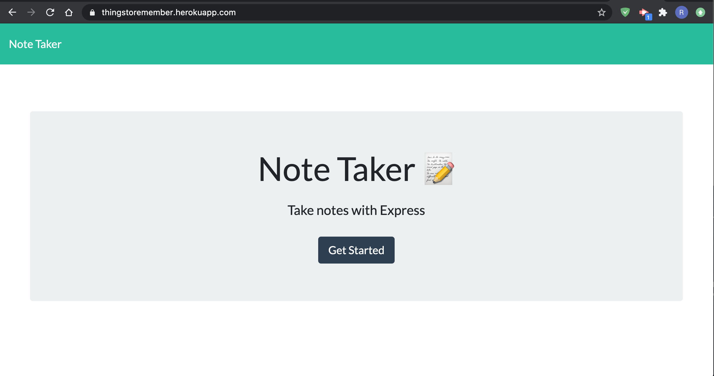

##  <h3 align = "center"> ThingsToRemember </h3>

                 

## Project Description 
      This application is a note taker program that will save and delete your notes using Node and Express.

      Link to deploid app:  https://thingstoremember.herokuapp.com/
                        
 ## Table of Contents
* [Project Description](#project-description)
* [Installation Instructions](#installation-instructions)
* [Usage Information](#usage-information)
* [Contribution Guidelines](#contribution-guidelines)
* [Test Instructions](#test-instructions)
* [Questions](#questions)

    
 
## Licenses    
    This applicaiton is covered with:
    

    
    This application is a note taker program that will save and delete your notes using Node and Express.
                        
 ## Installation Instructions

    Install Node and Express.
                        
 ## Usage Information
 
    User can use in their browser.
                        
 ## Contribution Guidelines
 
    
                        
 ## Test Instructions
 
    n/a
                        
 ## Questions
 
                        Feel free to contact me via Gifthub or by my e-mail!
Github Username:  rbraun04

 <a href = "https://github.com/rbraun04">GitHub</a> - Click to go to my profile!

 Email:  ryan@thelyricla.com

 [![LinkedIn][linkedin-shield]][linkedin-url]

[linkedin-shield]: https://img.shields.io/badge/-LinkedIn-black.svg?style=flat-square&logo=linkedin&colorB=555
[linkedin-url]: https://linkedin.com/in/ryangbraun
[Boost-shield]: https://img.shields.io/badge/License-Boost%201.0-lightblue.svg
[Boost-url]: https://www.boost.org/LICENSE_1_0.txt
                       